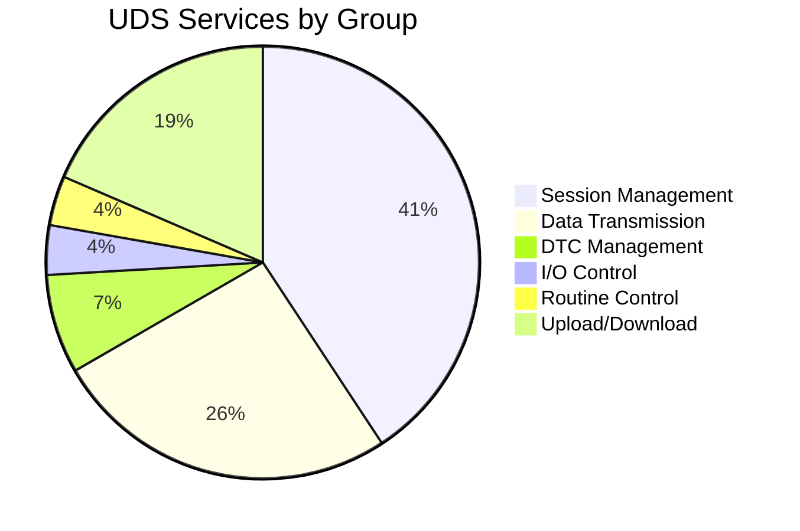
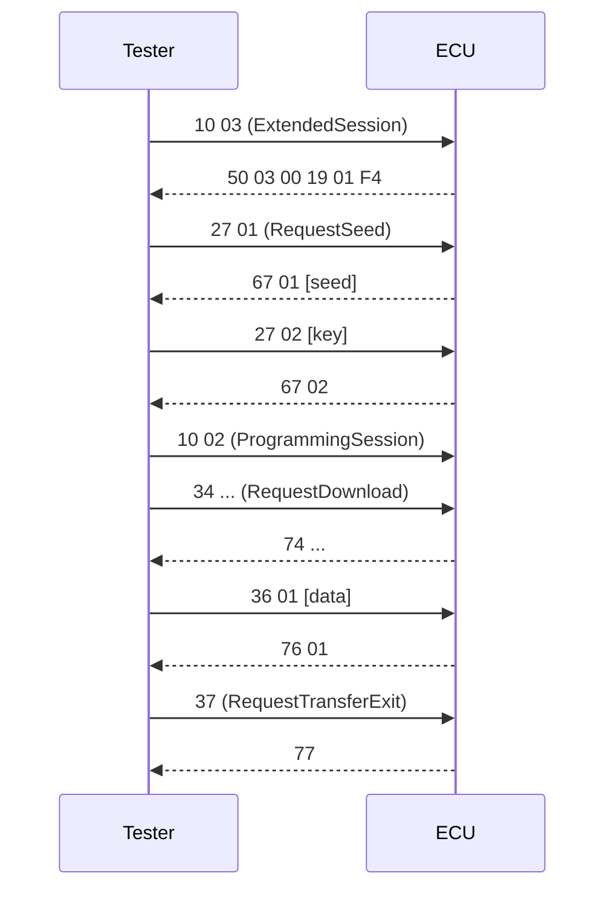

# pyudskit · Talk to your ECU in plain English


> LLM-powered ISO 14229 UDS assistant for automotive diagnostics.
> Encode, decode, and understand UDS messages using plain English.

---

## Table of Contents

- Overview
- Install
- Quick Start
- Why pyudskit
- Architecture
- Service Coverage
- Beginner Methods
- Service Shortcuts
- Diagnostic Flows
- Real-World Examples
- API Reference
- License
- Links

---

## Overview

pyudskit is a production‑quality Python library that wraps the full ISO 14229 UDS protocol and exposes it through plain‑English prompts and structured helpers. It is designed for beginners who want one‑liners and for advanced engineers who need full control over bytes, sessions, and diagnostic flows.

---

## Install

```python
pip install pyudskit
```

```python
export ANTHROPIC_API_KEY="sk-ant-..."
```

---

## Quick Start

```python
from pyudskit import UDS

uds = UDS()

# Ask a plain-English question
print(uds.ask("What is UDS?"))

# Encode a request
print(uds.encode("Read the VIN"))  # 22 F1 90

# Decode a response
print(uds.decode("62 F1 90 57 30 4C 41 53 54 31 32 33 34 35 36 37 38"))

# Explain a DTC
print(uds.explain_dtc("P0301"))
```

---

## Why pyudskit?

| 🔰 Beginner Friendly | 🔧 Full ISO 14229 | 🤖 LLM Powered |
|---|---|---|
| Plain English I/O | All 26+ services | Claude backend |
| One-liner methods | All 40+ NRCs | Multi-turn context |
| Built-in help() | 0xF1xx DIDs | Byte-accurate |

---

## Architecture


---

## Service Coverage (Graph)



---

## Flow Example (Graph)



---

## Beginner Methods

| Method | What it does | Example |
|---|---|---|
| `ask` | Plain English Q&A | `uds.ask("What is UDS?")` |
| `encode` | Intent → UDS bytes | `uds.encode("Read the VIN")` |
| `decode` | Bytes → plain English | `uds.decode("7F 22 31")` |
| `explain_dtc` | Explain a DTC | `uds.explain_dtc("P0301")` |
| `explain_service` | Service deep-dive | `uds.explain_service("0x27")` |
| `help` | Cheat sheet | `uds.help()` |

---

## Service Shortcuts

| Method | ISO 14229 Service | Example bytes |
|---|---|---|
| `read_did` | 0x22 ReadDataByIdentifier | `22 F1 90` |
| `write_did` | 0x2E WriteDataByIdentifier | `2E F1 90 ...` |
| `read_dtcs` | 0x19 ReadDTCInformation | `19 02 08` |
| `clear_dtcs` | 0x14 ClearDiagnosticInformation | `14 FF FF FF` |
| `ecu_reset` | 0x11 ECUReset | `11 01` |
| `tester_present` | 0x3E TesterPresent | `3E 80` |
| `routine_control` | 0x31 RoutineControl | `31 01 FF 00` |
| `request_download` | 0x34 RequestDownload | `34 ...` |

---

## Diagnostic Flows

| Flow method | Description |
|---|---|
| `programming_flow` | Full ECU flash sequence |
| `security_access_flow` | Seed-key walkthrough |
| `dtc_reading_flow` | Read + snapshot + clear |
| `io_control_flow` | I/O control options |
| `eol_flow` | End-of-line configuration |
| `ota_update_flow` | OTA update via 0x38 |

---

## Real-World Example: Workshop DTC Scan

```python
from pyudskit import UDS

uds = UDS()

# Read confirmed DTCs
result = uds.read_dtcs(0x08)
print(result["uds_bytes"])  # 19 02 08

# Explain known DTCs
for code in ["P0301", "U0100", "B0020"]:
    print(uds.explain_dtc(code))

# Clear all DTCs after repair
print(uds.clear_dtcs())
```

---

## Real-World Example: ECU Flash Programming

```python
from pyudskit import UDS

uds = UDS()

uds.switch_session("extended")
uds.communication_control("disable")
uds.control_dtc_setting("off")
uds.security_access_flow(level=1)
uds.switch_session("programming")
uds.routine_control(0xFF00, "start")  # erase
uds.request_download(0x08000000, 0x10000)
uds.transfer_data(0x01, "AA BB CC ...")
uds.request_transfer_exit()
uds.ecu_reset("hard")
```

---

## API Reference

https://pyudskit.readthedocs.io

---

## License

MIT

---

## Links

- Documentation: https://pyudskit.readthedocs.io
- Issues: https://github.com/sureshkonar/pyudskit/issues
- GitHub: https://github.com/sureshkonar/pyudskit
- PyPI: https://pypi.org/project/pyudskit
- Get Anthropic API Key: https://console.anthropic.com
