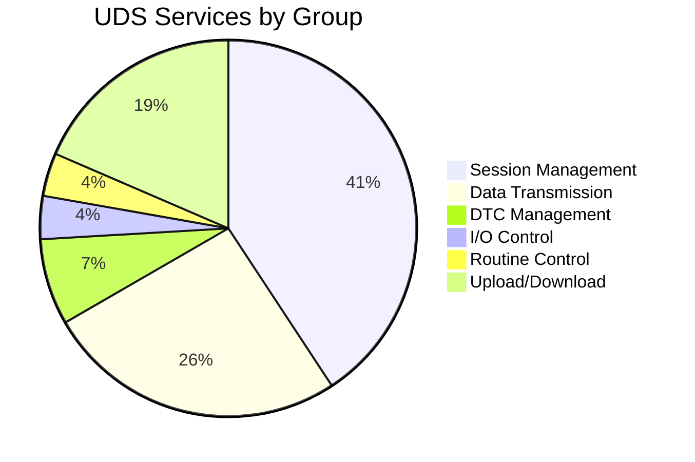

# pyudskit · Talk to your ECU in plain English


> LLM-powered ISO 14229 UDS assistant for automotive diagnostics.
> Encode, decode, and understand UDS messages using plain English.

---

## Table of Contents

- Overview
- Install
- Quick Start
- Architecture
- Methods at a Glance (UDS + AI)
- Offline Services (No LLM)
- AI Client (LLM)
- Examples
- API Reference
- License
- Links

---

## Overview

pyudskit is a production‑quality Python library that wraps the full ISO 14229 UDS protocol and exposes it through plain‑English prompts and structured helpers. It is designed for beginners who want one‑liners and for advanced engineers who need full control over bytes, sessions, and diagnostic flows.

---

## Install

```python
pip install pyudskit
```

```python
export ANTHROPIC_API_KEY="sk-ant-..."
```

---

## Quick Start

```python
from pyudskit import UDS

uds = UDS()

# Ask a plain-English question
print(uds.ask("What is UDS?"))

# Encode a request
print(uds.encode("Read the VIN"))  # 22 F1 90

# Decode a response
print(uds.decode("62 F1 90 57 30 4C 41 53 54 31 32 33 34 35 36 37 38"))

# Explain a DTC
print(uds.explain_dtc("P0301"))
```

## OEM Profiles (Straightforward)

Load an OEM profile to make services, DIDs, routines, and DTCs match your ECU:

```python
from pyudskit import UDS

uds = UDS(profile="pyudskit/profiles/oem_example.json")
print(uds.list_dids())
print(uds.explain_dtc("P0301"))
```

You can also load a dict at runtime:

```python
profile = {"name": "my_ecu", "dtcs": {"P0301": {"name": "Cylinder 1 Misfire"}}}
uds.load_profile(profile)
```

---

## Architecture




---

## Advanced Features

- OEM profile overrides for services, DIDs, routines, and DTCs
- SecurityAccess key algorithm registry + seed→key helper
- Transport session client with 0x78 (RCRRP) handling
- Mock transport for offline testing
- JSON/YAML export helpers

---

## Methods at a Glance (UDS + AI)

### UDS Client (Beginner)

- `ask(question)`
- `encode(description)`
- `decode(hex_bytes)`
- `explain_dtc(dtc_code)`
- `explain_service(service)`
- `explain_session(session)`
- `explain_nrc(nrc)`
- `decode_dtc_status(status_byte)`
- `parse_dtc_response(hex_bytes)`
- `lookup_did(did)`
- `help()`

### UDS Client (Advanced)

- `encode_request(description)`
- `decode_response(hex_bytes)`
- `read_did(did)`
- `read_dids(dids)`
- `write_did(did, data_hex)`
- `read_memory(address, length, addr_len=4, size_len=1)`
- `write_memory(address, data_hex, addr_len=4)`
- `read_scaling_did(did)`
- `define_dynamic_did(dynamic_did, source_dids)`
- `clear_dynamic_did(dynamic_did)`
- `read_dtcs(status_mask=0x08)`
- `read_dtc_snapshot(dtc_hex, record_num=0xFF)`
- `read_dtc_extended(dtc_hex, record_num=0xFF)`
- `read_supported_dtcs()`
- `clear_dtcs(group="all")`
- `ecu_reset(reset_type="hard")`
- `tester_present(suppress=True)`
- `communication_control(action="disable")`
- `control_dtc_setting(setting="off")`
- `io_control(did, option, value_hex="")`
- `routine_control(routine_id, action="start", data_hex="")`
- `request_download(address, size, compression=0, encrypting=0)`
- `request_upload(address, size)`
- `transfer_data(block_seq, data_hex)`
- `request_transfer_exit()`
- `request_file_transfer(mode, file_path)`
- `security_access_seed(level=1)`
- `security_access_key(level=1, key_hex="")`
- `security_access_key_from_seed(level, seed_hex, algorithm="default")`
- `register_security_algorithm(name, func)`
- `list_security_algorithms()`
- `switch_session(session="extended")`
- `security_access_flow(level=1)`
- `programming_flow()`
- `dtc_reading_flow()`
- `io_control_flow(did)`
- `eol_flow()`
- `ota_update_flow()`
- `list_services(group=None)`
- `list_dids()`
- `list_nrcs()`
- `list_routines()`
- `lookup_nrc(nrc_byte)`
- `lookup_service(sid)`
- `export(data, fmt="json")`
- `clear_session()`
- `ecu_state` (property)
- `load_profile(profile)`
- `profile` (property)

### AI Client (LLM)

- `encode(description)`
- `decode(hex_bytes)`
- `explain_service_result(service, result)`
- `verify_service_result(service, result)`
- `explain_response(service, response_hex)`
- `explain_dtc(dtc_code)`
- `explain_dtc_status(dtc_code, status_byte)`
- `explain_service(service_name_or_sid)`
- `explain_nrc(nrc)`
- `explain_session(session)`
- `get_flow(flow_name)`
- `analyze(hex_bytes)`
- `compare(expected_hex, actual_hex)`
- `suggest_next_step(last_request, last_response)`
- `chat(message)`
- `clear_history()`
- `reset()`

---

## Offline Services (No LLM)

Each service class supports `build_request`, `parse_response`, and `validate`.

### Session Management

- `DiagnosticSessionControl`
- `ECUReset`
- `SecurityAccess`
- `CommunicationControl`
- `Authentication`
- `TesterPresent`
- `AccessTimingParameter`
- `SecuredDataTransmission`
- `ControlDTCSetting`
- `ResponseOnEvent`
- `LinkControl`

### Data Transmission

- `ReadDataByIdentifier`
- `ReadMemoryByAddress`
- `ReadScalingDataByIdentifier`
- `ReadDataByPeriodicIdentifier`
- `DynamicallyDefineDataIdentifier`
- `WriteDataByIdentifier`
- `WriteMemoryByAddress`

### DTC Management

- `ClearDiagnosticInformation`
- `ReadDTCInformation`

### I/O Control

- `InputOutputControlByIdentifier`

### Routine Control

- `RoutineControl`

### Upload / Download

- `RequestDownload`
- `RequestUpload`
- `TransferData`
- `RequestTransferExit`
- `RequestFileTransfer`

---

## AI Client (LLM)

```python
from pyudskit.ai import AIClient
from pyudskit.services import ReadDataByIdentifier

ai = AIClient()
svc = ReadDataByIdentifier()
req = svc.build_request([0xF190])

print(ai.explain_service_result(svc, req))
print(ai.verify_service_result(svc, req))
print(ai.decode("7F 22 31"))
```

---

## Examples

### Workshop DTC Scan

```python
from pyudskit import UDS

uds = UDS()

result = uds.read_dtcs(0x08)
print(result["uds_bytes"])  # 19 02 08

for code in ["P0301", "U0100", "B0020"]:
    print(uds.explain_dtc(code))

print(uds.clear_dtcs())
```

### ECU Flash Programming

```python
from pyudskit import UDS

uds = UDS()

uds.switch_session("extended")
uds.communication_control("disable")
uds.control_dtc_setting("off")
uds.security_access_flow(level=1)
uds.switch_session("programming")
uds.routine_control(0xFF00, "start")
uds.request_download(0x08000000, 0x10000)
uds.transfer_data(0x01, "AA BB CC ...")
uds.request_transfer_exit()
uds.ecu_reset("hard")
```

---

## API Reference

https://pyudskit.readthedocs.io

---

## License

MIT

---

## Links

- Documentation: https://pyudskit.readthedocs.io
- Issues: https://github.com/sureshkonar/pyudskit/issues
- GitHub: https://github.com/sureshkonar/pyudskit
- PyPI: https://pypi.org/project/pyudskit
- Get Anthropic API Key: https://console.anthropic.com
